<!--- 
Microsoft-Style Documentation Layout
Compatible with GitHub, GitLab, Obsidian, and most Markdown viewers
--->

<!-- ==================== LEFT SIDEBAR MENU ==================== -->

### 📋 RAPPORT DE STAGE 2026
**Kaba Mohamed Asbour Diakité**

---

<strong>🏠 INTRODUCTION</strong>

- [🔒 Avis de Confidentialité](#confidentialite)
- [📄 Couverture](#couverture)
- [📑 Table des Matières](#table-des-matieres)
- [Introduction Générale](#introduction-generale)

<strong>🙏 REMERCIEMENTS & OBJECTIFS</strong>

- [🙏 Remerciements](#remerciements)
- [🎯 Objectifs stratégiques](#objectifs-strategiques-du-stage)
- [👁️ Vision professionnelle](#vision-dintegration-et-projection-professionnelle)

<strong>🏢 PRÉSENTATION CBG</strong>

- [Aperçu général](#41-aperçu-général-de-la-cbg)
- [Secteur d'activité](#42-secteur-dactivité)
- [Structure organisationnelle](#44-structure-organisationnelle)
- [Rôle du département informatique](#43-rôle-du-département-informatique)

<strong>📊 SEMAINE 1 - INDUCTION</strong>

- [Induction](#51-induction-et-sensibilisation-institutionnelle)
- [Santé & Sécurité](#sante-et-securite-au-travail)
- [Biodiversité](#biodiversite-et-engagement-environnemental)
- [Sensibilisation serpents](#programme-de-sensibilisation-aux-serpents)
- [Première immersion](#52-premiere-immersion-dans-les-departements-techniques--12022026)
- [Organisation infrastructurelle](#53-organisation-infrastructurelle)
- [Encadrement professionnel](#54-encadrement-professionnel)
- [Immersion SAP](#55-immersion-au-departement-sap--13022026)
- [Analyse critique](#56-observation-critique-et-apprentissage-personnel)
- [Difficultés](#7-difficultes-rencontrees)
- [Développement professionnel](#10-developpement-professionnel-et-personnel)

<strong>🟢 SEMAINE 2 - SAP & FICHES DE PAIE</strong>

- [Transactions SAP](#571-approfondissement-des-transactions-sap--16022026)
- [Assistance MIGO](#572-assistance-utilisateur--transaction-migo)
- [Serveur Apache](#573-mise-en-place-dun-serveur-apache--projet-fiches-de-paie)
- [Comptes SAP](#574-creation-des-comptes-sap-et-configuration)
- [Module MM](#575-choix-du-module-sap--orientation-vers-mm)
- [Projet Laravel](#576-participation-au-developpement-du-projet--19022026)
- [Difficultés](#7-difficultes-rencontrees-1)
- [Analyse](#8-analyse-critique--semaine-2)
- [Développement](#10-developpement-professionnel-1)

<strong>⚙️ SEMAINE 3 - MANAGEMENT OUTILS</strong>

- [Réunion hebdomadaire](#581-reunion-hebdomadaire-et-management-operationnel--23022026)
- [Inventaire applicatif](#582-inventaire-des-applications-utilisees-sur-le-reseau--24022026)
- [Assistance IW21](#583-assistance-sap--transaction-iw21--25022026)
- [InfoPath](#584-analyse-et-restructuration-dune-application-infopath--26022026)
- [Nettoyage Excel](#585-nettoyage-dun-fichier-logistique-volumineux)
- [Synthesia](#586-decouverte-doutils-innovants--synthesia)
- [Difficultés](#difficultes-rencontrees--semaine-3)
- [Analyse](#analyse-critique--semaine-3)
- [Développement](#developpement-professionnel-1)

<strong>📊 SEMAINE 4 - DATA & SYSTEMS</strong>

- [Power BI](#591-developpement-dun-tableau-de-bord-power-bi--02032026)
- [Support SAP](#592-traitement-de-donnees-excel-et-support-sap--03032026)
- [Module MM](#593-approfondissement-du-module-sap-mm--04032026)
- [AS400 & Cybersurveillance](#594-introduction-au-systeme-as400-et-a-la-cybersurveillance--05032026)
- [Architecture CBG](#595-decouverte-de-larchitecture-systeme-cbg-et-extraction-de-donnees-sap--06032026)
- [Difficultés](#difficultes-rencontrees--semaine-4)
- [Analyse](#analyse-critique--semaine-4)
- [Développement](#developpement-professionnel-2)

<strong>🔧 SEMAINE 5 - ADMIN & ACCÈS</strong>

- [Réunion & Power BI](#5101-reunion-hebdomadaire-et-suivi-des-projets--09032026)
- [AS400 PUB400](#5102-exploration-du-systeme-as400-et-de-lenvironnement-pub400--10032026)
- [Gestion mots de passe SAP](#5103-attribution-de-nouvelles-responsabilites--gestion-des-mots-de-passe-sap)
- [Difficultés SAP](#5104-difficultes-rencontrees-lors-du-renouvellement-des-mots-de-passe--11032026)
- [Données bancaires](#5105-nettoyage-et-traitement-de-donnees-bancaires--12032026)
- [Formulaire HSE](#5106-developpement-dun-formulaire-hse-avec-infopath--13032026)

<strong>🚀 SEMAINES 6 & 7 - POWER APPS</strong>

- [Lancement Power Apps](#5113-lancement-du-projet-power-apps-laissez-passer--18032026)
- [Complexité](#5114-avancement-du-developpement-et-complexite-de-power-apps--19032026)
- [Développement avancé](#5122-poursuite-du-projet-power-apps)
- [Automatisation](#5123-introduction-a-lautomatisation)
- [Difficultés S6-7](#difficultes-rencontrees--semaine-6)
- [Analyse S6-7](#analyse-critique--semaine-6)

<strong>🔄 SEMAINES 8 À 12 - FINALISATION</strong>

- [Semaine 8 - Optimisation](#513-huitieme-semaine--integration-des-workflows-et-optimisation-des-outils)
- [Semaine 9 - Consolidation](#514-neuvieme-semaine--support-verification-et-consolidation-des-acquis)
- [Semaine 10 - Stabilisation](#515-dixieme-semaine--approfondissement-fonctionnel-et-stabilisation-des-projets)
- [Semaine 11 - Autonomie](#516-onzieme-semaine--autonomie-responsabilites-et-maturite-professionnelle)
- [Semaine 12 - Bilan](#517-douzieme-semaine--bilan-final-et-cloture-du-stage)

<strong>📎 ANNEXES & CONCLUSION</strong>

- [Compétences techniques](#8-competences-techniques-acquises)
- [Difficultés générales](#9-difficultes-rencontrees)
- [Contribution](#10-contribution-a-lentreprise)
- [Développement personnel](#11-developpement-personnel-et-professionnel)
- [Conclusion générale](#conclusion-generale)
- [Annexes](#annexes-1)

<!-- ==================== MAIN CONTENT AREA ==================== -->

# RAPPORT DE STAGE DE KABA MOHAMED ASBOUR DIAKITÉ - 2026

---

> **🔒 AVIS DE CONFIDENTIALITÉ**  
> *Ce document contient des informations relatives à mon stage au sein de la **COMPAGNIE DES BAUXITES DE GUINEE (CBG)**.*  
> *Il est destiné uniquement à des fins d'évaluation académique.*  
> *Merci de ne pas le diffuser sans autorisation préalable.*
> *Merci de contacter: Tel:(+224) 626-73-26-82 / 611-57-12-58.*
>  asbourkaba3657diakite@gmail.com
>  asbourmohamed3657@outlook.fr

---

# COVER PAGE - PAGE DE GARDE

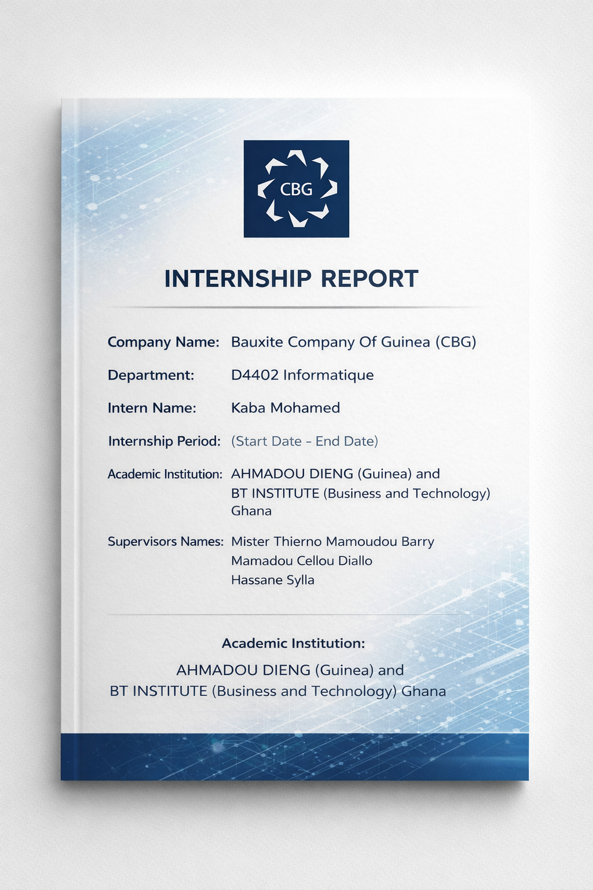

---

# TABLE OF CONTENT / TABLE DES MATIÈRES

<strong>Introduction Générale</strong>

Brève présentation du stage, objectifs et contexte.

<strong>2. Remerciements</strong>

Remerciez l'entreprise, superviseur et établissement scolaire.

<strong>3. Résumé Exécutif</strong>

Brève présentation de l'objectif, des missions, des compétences clés et des résultats obtenus.

<strong>4. Présentation de l'Entreprise</strong>

- Aperçu général de la CBG
- Secteur d'activité
- Rôle du département informatique
- Structure organisationnelle

<strong>5. Description du Département Informatique D4402</strong>

- Objectifs du département
- Infrastructure informatique
- Responsabilités principales

<strong>6. Objectifs du Stage</strong>

- Objectifs professionnels
- Vision d'intégration

<strong>7. Activités Réalisées</strong>

- Semaine 1 : Induction
- Semaine 2 : SAP & Fiches de paie
- Semaines 3 à 12 : Développement technique

<strong>8. Compétences Techniques Acquises</strong>

SAP, Power BI, Power Apps, AS400, etc.

<strong>9. Difficultés Rencontrées</strong>

Problèmes techniques, organisation, délais.

<strong>10. Contribution à l'Entreprise</strong>

Amélioration des processus, documentation, automatisation.

<strong>11. Développement Personnel et Professionnel</strong>

Travail en équipe, rigueur, adaptabilité.

<strong>12. Conclusion Générale</strong>

Bilan global et impact sur le parcours professionnel.

<strong>13. Annexes</strong>

Captures d'écran, documents, ressources.

---

## INTRODUCTION

Ce stage s'inscrit dans le cadre de ma formation académique et représente une étape essentielle dans mon parcours professionnel. Il a été effectué au sein de la **Compagnie des Bauxites de Guinée (CBG)** , plus précisément dans le département D4402 Informatique.

L'objectif principal de cette immersion était de découvrir le fonctionnement d'un environnement industriel complexe, d'acquérir des compétences techniques concrètes et de participer activement aux activités du département informatique.

Au cours de cette expérience, j'ai été impliqué dans plusieurs domaines clés tels que :
- les systèmes ERP (SAP),
- l'analyse et la gestion des données,
- le support technique,
- le développement d'applications (Power Apps, Django),
- et l'automatisation des processus (Power Automate).

Ce stage m'a permis de développer une compréhension globale des systèmes d'information en entreprise, tout en renforçant ma capacité d'adaptation, d'analyse et de résolution de problèmes.

<video src="./INTERNSHIPSource/INTERNSHIP FILE/NEW ARRIVAL/video.mp4" controls autoplay muted loop width="900"></video>

---

## Remerciements

Je tiens à exprimer ma profonde gratitude à la **Compagnie des Bauxites de Guinée**, **CBG**, et à sa **Direction Général son Excellence Monsieur Karifa Condé** pour m’avoir offert l’opportunité d’effectuer mon stage au sein du département **D4402 Informatique**. Cette expérience représente une étape déterminante dans mon parcours académique et professionnel.
Je remercie particulièrement mes encadreurs professionnel,**Bassoum Hamady(Surintentant Informatique)**, **Monsieur Barry Thierno Mamoudou  (Coordinateur Business Apps), Monsieur Diallo Mamadou Cellou  (Analyste Senior Centre de Competence SAP), Monsieur Sylla Hassane  (Analyste Application & BI)** pour leur accompagnement, leur disponibilité, leur conseils techniques et leur confiance qu’ils m’ont accordée tout au long de cette période. leur encadrement m’a permis de développer mes compétences techniques et d’adopter une posture professionnelle rigoureuse.
Mes remerciements s’adressent également à l’ensemble des collaborateurs du département pour leur accueil, leur esprit d’équipe et leur volonté de partager leurs connaissances.
Enfin, je remercie mon établissement académique, **Ahmadou Dieng** et **Busness and Technolgy Institute (Ghana)**, ainsi que mes encadreur académique respectivement, **Monsieur Alpha Oumar Leno** et **Mister Koffi** and **Mister George (CEO)** pour leur suivi pédagogique et les orientations qui ont contribué à la réussite de ce stage.

---

## Objectifs stratégiques du stage

### Objectifs professionnels

Au-delà de la validation académique, ce stage représente pour moi une opportunité stratégique d'intégration progressive dans un environnement industriel exigeant.

Mon objectif est de devenir rapidement opérationnel et utile au département, en apportant une contribution concrète aux activités quotidiennes tout en assimilant efficacement les processus internes, les standards techniques et la culture organisationnelle de l'entreprise.

Je m'engage à :
- comprendre en profondeur les méthodes de travail et les flux opérationnels,
- développer une autonomie progressive dans l'exécution des tâches confiées,
- identifier les opportunités d'amélioration des processus,
- apporter une valeur ajoutée mesurable à travers la rigueur, la discipline et l'initiative.

Mon ambition est de démontrer, par la performance et l'engagement, ma capacité à évoluer vers des responsabilités accrues au sein de l'organisation.

---

### Vision d'intégration et projection professionnelle

Ce stage constitue également une phase d'évaluation mutuelle :
- pour l'entreprise, mesurer mon potentiel d'adaptation et de contribution,
- pour moi, confirmer mon alignement avec les exigences et la culture du secteur minier.

À travers cette immersion, je souhaite consolider mes compétences techniques, renforcer ma compréhension des enjeux industriels et m'inscrire durablement dans une trajectoire professionnelle cohérente avec les standards de performance de l'entreprise.

À terme, mon objectif est de mériter une intégration professionnelle en démontrant que je peux être un acteur fiable, rigoureux et engagé dans la réalisation des objectifs stratégiques de l'organisation.

---

## 4. Présentation de l'entreprise

### 4.1 Aperçu général de la CBG

La **Compagnie des Bauxites de Guinée (CBG)** est un leader mondial dans l'industrie de la bauxite. Elle exploite des mines situées dans la localité de Sangarédi au nord-ouest de la République de Guinée et produit plus de **16 millions** de tonnes de bauxite de qualité supérieure par an.

Ses actions sont détenues à **49%** par l'**État guinéen** et à **51%** par **Halco Mining**, un consortium international. Depuis **1973**, la CBG a contribué à plus de **5 milliards** de dollars aux revenus de l'État guinéen et investi près d'un milliard de dollars dans la modernisation de ses actifs depuis **2016**.

### 4.2 Secteur d'activité

La CBG opère dans le secteur minier, spécialisé dans l'extraction et l'exportation de bauxite vers l'Amérique du Nord, l'Europe et la Chine. Elle exploite les mines de **Sangarédi, Bidikoum, Silidara et N'Dangara**, avec une capacité de production visant **22,5 millions** de tonnes en **2018** et **40 millions** à terme.

L'entreprise intègre également des infrastructures logistiques (portuaires, voies ferrées) et met l'accent sur le développement communautaire, la santé-sécurité et les normes environnementales de la Société Financière Internationale (SFI).

### 4.3 Rôle du département informatique

Le département informatique de la CBG est un pilier central garantissant la disponibilité, la performance et la sécurité des systèmes informatiques qui soutiennent l'ensemble des activités de la société. Il gère les infrastructures modernes intégrant sites d'extraction, installations portuaires et services techniques/administratifs.

Dans un contexte industriel complexe, il assure le support matériel, l'installation de logiciels, le dépannage et la maintenance des systèmes critiques comme **SAP**, **Power BI** et **AS400**, soutenant les opérations minières et logistiques.

### 4.4 Structure organisationnelle

- La CBG dispose de trois sièges : siège social à Kamsar **(BP 100 Kamsar / BP 523 Conakry)**, siège opérationnel à Sangarédi et siège international à Wilmington, Delaware (USA). Elle emploie plusieurs milliers de personnes avec une organisation incluant direction des opérations, secrétaire général et chefs de département.

- Le département informatique **(D4402)** intervient en appui transversal aux services techniques, administratifs et logistiques, sous la supervision d'un directeur des opérations et d'une gouvernance alignée sur des standards internationaux.

**Organigramme du D4402 / Organization Structure of D4402**

---

## 5. Description du département informatique D4402

### 5.1 Objectifs du département

Le département D4402 Informatique vise à garantir la continuité des opérations critiques en assurant la disponibilité et la sécurité des systèmes d'information. Ses objectifs incluent l'alignement de l'IT avec les enjeux stratégiques miniers, l'optimisation des processus décisionnels et la réduction des temps d'arrêt opérationnels.

### 5.2 Infrastructure informatique

L'infrastructure comprend :
- **Systèmes ERP** : SAP (modules MM, FI/CO) pour la gestion logistique et financière ;
- **Serveurs et AS400** : hébergement d'applications critiques (Oracle, SAP) ;
- **Outils analytiques** : Power BI, Power Apps, SharePoint pour reporting et digitalisation ;
- **Réseaux et cybersécurité** : support à distance (Datto), vidéosurveillance (Genetec Omnicast), gestion des accès.

### 5.3 Responsabilités principales

- **Support utilisateur** : assistance SAP (transactions MIGO, IW21, SE38), dépannage matériel/réseau ;
- **Gestion des données** : extraction SAP, nettoyage Excel, modélisation Power BI ;
- **Développement et digitalisation** : applications InfoPath/SharePoint, Power Apps (Laissez-Passer), serveurs Apache/PHP ;
- **Administration système** : AS400/PUB400, renouvellement mots de passe SAP, inventaires applicatifs ;
- **Sécurité et conformité** : gouvernance des accès, cybersurveillance, procédures standardisées.

---

<!-- ==================== SEMAINE 1 ==================== -->

## 5.1 Première semaine d'immersion

### 5.1 Induction et sensibilisation institutionnelle

Ma première semaine a débuté par une phase d'intégration, orientée principalement vers la culture d'entreprise, la sécurité et les engagements environnementaux de la CBG.

### Santé et sécurité au travail

Nous avons été formés sur :
- les principes fondamentaux de santé et sécurité,
- les 12 règles d'or de la CBG,
- les bonnes pratiques en environnement industriel.

Cette session a permis de comprendre que la sécurité constitue une priorité stratégique au sein de l'entreprise.

### Biodiversité et engagement environnemental

Une présentation détaillée a été faite sur :
1. L'importance de la biodiversité
2. Le Biodiversity Action Plan de la CBG
3. L'engagement NNL/NG (No Net Loss / Net Gain)
4. Les partenariats environnementaux (REB, GAC, AMR, etc.)

Étant certifié dans le domaine du changement climatique via le programme des Nations Unies, cette partie a eu un impact particulier sur moi. Elle démontre que la CBG intègre réellement les enjeux climatiques et environnementaux dans sa stratégie opérationnelle.

### Programme de sensibilisation aux serpents

Nous avons également suivi une session de sensibilisation sur :
- les comportements à adopter face à un serpent,
- les procédures à suivre en cas de morsure,
- les consignes de prévention en zone à risque.

Cela renforce la culture de prévention et d'anticipation des risques naturels.

### 5.2 Première immersion dans les départements techniques – 12/02/2026

Lors de notre première journée opérationnelle, nous avons été répartis dans différents pôles :
- SAP,
- Maintenance,
- Network Management System.

Nos premières missions consistaient à :
- installer des ordinateurs,
- configurer les systèmes,
- intégrer les postes au réseau interne de la CBG.

Lors de l'installation, nous avons accédé au **BIOS** afin de :
- supprimer les anciennes configurations,
- nettoyer les sauvegardes existantes,
- réinitialiser et préparer le système pour un redéploiement sécurisé.

Cela m'a permis de renforcer mes compétences en configuration matérielle et en déploiement IT.

### 5.3 Organisation infrastructurelle

Au bureau de Monsieur Mohamed Kaba, nous avons participé à :
- l'organisation des câbles,
- la gestion des switches,
- l'inventaire du matériel informatique : ordinateurs et écrans.

Monsieur Kaba nous a posé plusieurs questions techniques afin d'évaluer notre niveau :
- Qu'est-ce que l'informatique ?
- Quels sont les différents types de réseaux ?
- Comment installer et réinstaller un ordinateur ?

Cette approche interactive permet d'identifier les compétences réelles des stagiaires.

### 5.4 Encadrement professionnel

Au bureau Maintenance et Infrastructure, Monsieur **N'Famoussa Osvaldo Camara** nous a rappelé les règles de comportement professionnel :
- choisir le respect en toute circonstance,
- prendre des notes systématiquement,
- adopter une posture d'apprentissage permanent.

Il a insisté sur le fait que **les personnes intelligentes prennent des notes**, ce qui souligne l'importance de la rigueur et de la documentation en environnement professionnel.

### 5.5 Immersion au département SAP – 13/02/2026

Nous avons été accueillis au bureau SAP par **Monsieur Moud**, qui nous a ensuite présenté son équipe. Grâce à l'accompagnement d'Abdoulaye, j'ai appris l'usage de plusieurs transactions :
- **LSMW** : migration et gestion des données utilisateurs,
- **SUIM** : consultation et extraction des utilisateurs SAP,
- **SE16N** : extraction de tables (exemple: PA002),
- **FBL5N** : consultation des comptes clients.

J'ai également observé le processus suivant :
- extraction des données RH,
- nettoyage sous Excel,
- chargement dans SAP.

Mamadou Saidou travaillait sur des rapports **Power BI** nécessitant un nettoyage préalable des données. Cela m'a amené à m'interroger sur l'optimisation possible via une connexion directe SAP–Power BI pour réduire la manipulation manuelle.

Monsieur Cellou a recommandé la formalisation de procédures de traitement des données afin de standardiser les opérations.

### 5.6 Observation critique et apprentissage personnel

Lors d'une extraction de données avec **Monsieur Sylla Hassane**, je n'ai pas su répondre immédiatement à la question : *« Quelle transaction permet d'extraire une table ? »*. La réponse était **SE16N**.

Cette situation m'a permis d'identifier mes axes d'amélioration et de renforcer ma maîtrise des transactions SAP.

## 7. Difficultés rencontrées – Semaine 1

Un problème technique a été rencontré lors de l'installation réseau au département **Hydrocarbures**. L'ouverture murale destinée aux câbles était insuffisante. Deux câbles étaient déjà en place et l'espace ne permettait pas l'ajout de nouveaux câbles.

Cette situation met en évidence **l'importance de la planification d'infrastructure physique** dans les installations réseau.

## 10. Développement professionnel et personnel – Semaine 1

Cette première semaine m'a permis de :
1. comprendre l'importance de la culture sécurité,
2. observer les flux de gestion des données en environnement ERP,
3. identifier les opportunités d'optimisation des processus,
4. développer une posture professionnelle plus rigoureuse.

Elle a également renforcé ma capacité d'analyse critique, notamment concernant l'intégration SAP–Power BI.

---

<!-- ==================== SEMAINE 2 ==================== -->

## 5.7 Deuxième semaine : approfondissement SAP et projet digital de fiches de paie

### 5.7.1 Approfondissement des transactions SAP – 16/02/2026

Durant cette deuxième semaine, j'ai poursuivi mon immersion au sein du centre SAP avec un renforcement des connaissances transactionnelles.

**Transactions étudiées :**
- **MB51** : consultation des mouvements de stock sortants,
- **MB24** : réservation de matériel en magasin,
- **CSKS** : affichage des centres de coûts/départements,
- **MSEG** : affichage des tables de documents matériels,
- **MS20** : vérification des fréquences de connexion,
- **SU01** : création et modification des autorisations utilisateurs.

J'ai rencontré des difficultés dans la compréhension du processus de réservation (MB24). Monsieur Cellou m'a expliqué en détail le flux logique :
1. Demande interne
2. Réservation dans le système
3. Validation
4. Sortie de stock

Cette clarification m'a permis de mieux comprendre la logique intégrée du module MM.

### 5.7.2 Assistance utilisateur : transaction MIGO

Nous avons assisté un utilisateur confronté à un problème de confirmation d'entrée de marchandises via la transaction MIGO. L'entrée n'ayant pas été correctement enregistrée dans SAP, nous avons identifié que la correction devait être effectuée par le service transit avant validation.

Une assistance à distance via l'application Datto était prévue afin d'accompagner l'utilisateur après correction.

Cette situation m'a permis de comprendre l'importance de la cohérence des flux logistiques dans SAP.

### 5.7.3 Mise en place d'un serveur Apache : projet fiches de paie

Nous avons participé à l'installation d'un serveur Apache sous environnement Windows Server pour un projet stratégique : la digitalisation des fiches de paie.

**Objectif du projet :**
- Permettre aux employés de recevoir leurs bulletins de salaire sur ordinateur ou téléphone,
- Réduire la consommation de papier,
- Diminuer les coûts IT liés à l'impression,
- Améliorer les KPI budgétaires du département.

Le serveur Apache a été configuré manuellement. Lorsque j'ai interrogé Monsieur Sylla Hassane sur cette approche, il a expliqué qu'il souhaitait :
- avoir un contrôle total sur les composants,
- pouvoir mettre à jour Apache et PHP indépendamment,
- maîtriser les dépendances système.

Cette démarche révèle une volonté d'architecture maîtrisée et modulaire.

### 5.7.4 Création des comptes SAP et configuration
.png)
J'ai obtenu mes accès Windows et SAP durant cette semaine. La procédure de configuration SAP Logon comprenait :
- création d'un nouveau dossier,
- création d'une nouvelle connexion,
- paramétrage des environnements (ECX, ECP),
- configuration du mot de passe.

Cette étape m'a permis de mieux comprendre l'environnement technique SAP côté utilisateur.
.png)
.png)

### 5.7.5 Choix du module SAP : orientation vers MM
.png)
Suite à une orientation demandée par Monsieur Moud Barry, nous devions choisir un module SAP correspondant à notre profil académique. Compte tenu de mes différents parcours (QSHE, logistique et systèmes), j'ai choisi le module **MM (Material Management)**.

**Transactions étudiées :**
- **MMBE** : aperçu des stocks,
- **MB51** : liste des documents matériels,
- **MD04** : situation des besoins et disponibilités.

J'ai commencé à analyser le cycle complet d'approvisionnement :
1. Demande d'achat
2. Commande
3. Réception (MIGO)
4. Mouvement de stock
5. Comptabilisation

Cette vision globale m'a permis de relier les transactions entre elles.

### 5.7.6 Participation au développement du projet – 19/02/2026

Nous avons assisté Monsieur Sylla Hassane dans :
- la configuration Laravel,
- l'installation MySQL,
- la connexion base de données,
- l'application PHP.

Ce projet de plateforme de bulletins de paie combine :
- PHP,
- Laravel,
- MySQL,
- Apache Server.

Il constitue une première immersion dans un environnement de développement web interne.

## 7. Difficultés rencontrées – Semaine 2

1. **Difficulté de compréhension du processus de réservation (MB24)**
   - *Solution* : Explication détaillée du flux par un encadrant.
2. **Retard dans l'obtention du matériel (écran)**
   - *Impact* : ralentissement temporaire de productivité.
3. **Difficulté d'orientation module SAP**
   - *Contexte* : profil académique polyvalent.
   - *Solution* : choix stratégique basé sur la cohérence logistique.

## 8. Analyse critique – Semaine 2

### 8.1 Logique intégrée des flux SAP

Cette semaine m'a permis de comprendre que SAP fonctionne comme un système interconnecté :
- une réservation impacte le stock,
- un mouvement génère une écriture,
- une erreur logistique bloque un processus financier.

Le système impose une discipline opérationnelle rigoureuse.
.png)

### 8.2 Digitalisation et réduction des coûts

Le projet de dématérialisation des fiches de paie illustre une transformation digitale orientée :
- réduction des coûts directs,
- réduction de l'empreinte environnementale,
- amélioration de l'efficacité administrative.

Cela montre que l'IT devient un levier stratégique et non uniquement un support technique.

### 8.3 Approche technique : manuelle vs automatisée

Le choix d'installation manuelle d'Apache révèle une préférence pour :
- la maîtrise technique,
- le contrôle des dépendances,
- la sécurité des mises à jour.

Cette approche est pertinente dans un environnement industriel où la stabilité prime sur la rapidité de déploiement.

## 10. Développement professionnel – Semaine 2

Cette deuxième semaine m'a permis de :
- comprendre la logique des flux logistiques SAP,
- développer une vision orientée processus,
- améliorer ma capacité d'apprentissage autonome,
- renforcer ma rigueur dans la mémorisation des transactions.

---

<!-- ==================== SEMAINE 3 ==================== -->

## 5.8 Troisième semaine : coordination managériale, outils digitaux et gestion de données

### 5.8.1 Réunion hebdomadaire et management opérationnel – 23/02/2026

Chaque lundi, Monsieur Moud organise une réunion d'équipe centrée sur :
- la sécurité,
- le suivi des projets,
- la revue des tâches via l'outil de gestion Autotask/Datto.

Cette session hebdomadaire permet :
- d'aligner les priorités,
- de suivre l'avancement des projets,
- d'identifier les risques,
- de renforcer la culture sécurité.

J'ai observé un style de management structuré, orienté vers la performance et la responsabilité collective.

### 5.8.2 Inventaire des applications utilisées sur le réseau – 24/02/2026

Une mission nous a été confiée : réaliser un inventaire des applications utilisées au sein de la CBG sur les cinq dernières années.

Pour cela, nous avons procédé à :
- l'installation du Microsoft Assessment and Planning Toolkit,
- l'analyse du réseau,
- la collecte automatisée des données.

**Résultat :** plus de 2000 éléments recensés.

Cette activité m'a permis de comprendre l'importance :
- de la cartographie applicative,
- de la gouvernance IT,
- du contrôle des actifs numériques.

### 5.8.3 Assistance SAP : transaction IW21 – 25/02/2026

Nous avons assisté un utilisateur pour la création d'un avis via la transaction IW21. La difficulté rencontrée concernait un problème de prise de contrôle à distance du poste utilisateur.

Cette situation m'a permis d'identifier l'importance :
- des outils de support à distance fiables,
- de la réactivité IT,
- de la maîtrise des transactions de maintenance.

### 5.8.4 Analyse et restructuration d'une application InfoPath – 26/02/2026

Nous avons commencé l'analyse d'une application développée sous InfoPath, destinée à reproduire une fiche de présence Santé-Sécurité.

L'objectif était de :
- décomposer l'architecture,
- identifier les rôles utilisateurs,
- comprendre la logique des champs et validations.

Cette phase d'analyse fonctionnelle m'a permis de développer une approche méthodique de lecture applicative.

### 5.8.5 Nettoyage d'un fichier logistique volumineux

Un fichier Excel de gestion de stock nous a été confié :
- taille : 7 Mo,
- volume : plus de 87 000 lignes,
- colonnes : A à O.

**Difficultés rencontrées :**
- lenteur du système,
- surcharge liée aux formules,
- temps de traitement de 5 à 10 minutes par action.

Malgré ces contraintes, j'ai :
- nettoyé les données,
- trié selon des critères spécifiques,
- optimisé partiellement la structure.

### 5.8.6 Découverte d'outils innovants : Synthesia

Monsieur Moud nous a présenté un nouvel outil basé sur l'intelligence artificielle, **Synthesia**, utilisé pour la création de vidéos assistées par IA.

Cet outil pourrait être exploité pour :
- des formations internes,
- des communications sécurité,
- des supports pédagogiques.

Cette découverte a élargi ma vision sur l'intégration de l'IA dans les processus d'entreprise.

## 7. Difficultés rencontrées – Semaine 3

Les principales difficultés ont été :
- le problème de performance du poste lors du traitement de données volumineuses,
- la difficulté de prise de contrôle à distance,
- la reprise du travail suite à une modification des exigences.

## 8. Analyse critique – Semaine 3

### 8.1 Leadership et gouvernance IT
Les réunions hebdomadaires démontrent une gouvernance structurée, un pilotage basé sur des indicateurs et une culture de responsabilité partagée.

### 8.2 Gouvernance des actifs numériques
L'inventaire applicatif met en évidence l'importance de la maîtrise du parc logiciel, du contrôle des licences et de la sécurité réseau.

### 8.3 Limites d'Excel dans la gestion de données volumineuses
Le traitement d'un fichier de 87 000 lignes révèle les limites d'Excel en environnement industriel et la nécessité d'outils plus robustes comme les bases de données, Power BI ou SQL.

### 8.4 Digitalisation et intelligence artificielle
L'introduction d'outils comme Synthesia montre que l'IA devient un levier de communication interne et que l'innovation est encouragée au sein du département.

## 10. Développement professionnel – Semaine 3

Cette semaine m'a permis de :
- comprendre les mécanismes de management IT,
- développer mes compétences en analyse de données,
- améliorer ma gestion du stress face aux contraintes techniques,
- renforcer ma capacité d'apprentissage autonome.

---

<!-- ==================== SEMAINE 4 ==================== -->

## 5.9 Quatrième semaine : analyse de données, systèmes d'information et support utilisateurs

### 5.9.1 Développement d'un tableau de bord Power BI – 02/03/2026

Au cours de cette journée, j'ai poursuivi les travaux confiés par Monsieur Moud. J'ai notamment travaillé sur la modélisation d'un tableau de bord Power BI consacré à l'analyse de données étudiantes.

L'objectif de cet exercice était de développer mes compétences en analyse de données et en visualisation, en structurant les informations sous forme de graphiques et d'indicateurs pertinents.

Dans l'après-midi, Monsieur Hassane a présenté une nouvelle version de l'application de gestion des bulletins de paie destinée au département des ressources humaines.

### 5.9.2 Traitement de données Excel et support SAP – 03/03/2026

Monsieur Hassane nous a confié un travail supplémentaire impliquant l'analyse d'un fichier Excel. L'objectif était d'identifier des articles ayant la même désignation mais des prix différents.

Face aux difficultés rencontrées, Monsieur Moud nous a ensuite montré la procédure correcte :
- transaction utilisée : **SE38**,
- programme exécuté : **SALVBSADMINMAINTAIN**.

Cette procédure permet d'activer la fonctionnalité d'export Excel pour un utilisateur spécifique. Cette démonstration m'a permis de mieux comprendre la gestion des autorisations et des fonctionnalités utilisateurs dans SAP.

### 5.9.3 Approfondissement du module SAP MM – 04/03/2026

Cette journée a été consacrée à l'approfondissement de mes connaissances sur le module SAP MM (Material Management).

J'ai étudié plusieurs transactions importantes liées au processus d'approvisionnement :
- **ME51N** : création de demande d'achat,
- **ME52N** : modification de demande d'achat,
- **ME5A** : affichage de la liste des demandes d'achat,
- **ME21N** : création de commande d'achat.

Cette étude m'a permis de comprendre le cycle complet du processus d'approvisionnement dans SAP.

### 5.9.4 Introduction au système AS400 et à la cybersurveillance – 05/03/2026

Monsieur Moud nous a présenté certaines commandes du système AS400, notamment la commande **Override**, qui permet de rediriger temporairement l'accès à certains fichiers ou ressources.

Par ailleurs, nous avons suivi une session de formation en ligne consacrée aux systèmes de vidéosurveillance CCTV, utilisant la plateforme **Genetec Omnicast**.

### 5.9.5 Découverte de l'architecture système CBG et extraction de données SAP – 06/03/2026

Afin de mieux comprendre l'architecture informatique de l'entreprise, Monsieur Moud nous a partagé plusieurs ressources sur le système **AS400**, qui constitue une composante centrale de l'infrastructure informatique. Ce système héberge plusieurs applications importantes, notamment SAP, Oracle et d'autres applications critiques.

Pour nous permettre de pratiquer sans risque pour les systèmes de production, nous avons utilisé la plateforme **PUB400**, un environnement de formation permettant d'exécuter des commandes AS400.

Par ailleurs, j'ai assisté Monsieur Saidou dans l'extraction de données SAP destinées à la création de rapports sous Power BI.

## 7. Difficultés rencontrées – Semaine 4

Plusieurs difficultés ont été rencontrées :
- difficulté à automatiser l'analyse de données Excel,
- complexité de certaines autorisations SAP,
- gestion simultanée de plusieurs tâches techniques.

## 8. Analyse critique – Semaine 4

Cette semaine a mis en évidence l'importance de l'intégration des systèmes d'information dans un environnement industriel. L'utilisation combinée de technologies telles que SAP, Power BI, AS400, SharePoint et InfoPath montre que la performance organisationnelle repose sur une interopérabilité efficace des outils numériques.

Elle a également montré que la gestion des données devient un enjeu stratégique, notamment pour l'aide à la décision et le pilotage des activités.

## 10. Développement professionnel – Semaine 4

Cette quatrième semaine m'a permis de :
- renforcer mes compétences en SAP MM,
- développer mes capacités d'analyse de données,
- mieux comprendre l'architecture informatique d'une grande entreprise industrielle,
- améliorer ma capacité à travailler sur plusieurs projets simultanément.

---

<!-- ==================== SEMAINE 5 ==================== -->

## 5.10 Cinquième semaine : administration des systèmes, gestion des accès et analyse de données

### 5.10.1 Réunion hebdomadaire et suivi des projets – 09/03/2026

Comme chaque début de semaine, l'équipe a tenu une réunion de coordination afin de faire un point global sur l'état d'avancement des différents projets et sous-projets du département.

Au cours de cette réunion, Monsieur Abdoulaye a présenté son travail relatif à la gestion des congés des employés. Il a notamment développé un rapport **Power BI Report Builder**, qu'il a conçu depuis la phase de structuration des données jusqu'à la visualisation finale.

### 5.10.2 Exploration du système AS400 et de l'environnement PUB400 – 10/03/2026

Cette journée a été consacrée à la poursuite de mes travaux d'extraction de données pour Monsieur Saidou, ainsi qu'à l'apprentissage du système AS400.

J'ai notamment utilisé la plateforme **PUB400**, qui permet de pratiquer les commandes du système dans un environnement sécurisé. La configuration initiale a représenté un défi technique.

À l'issue de ces recherches, j'ai rédigé une documentation personnelle sur l'utilisation de PUB400 et les bases du système AS400.

### 5.10.3 Attribution de nouvelles responsabilités : gestion des mots de passe SAP

Au cours de cette semaine, mon collègue stagiaire et moi avons reçu une nouvelle responsabilité : **la gestion du renouvellement des mots de passe des utilisateurs SAP**.

Cette tâche consiste à :
- vérifier l'identité de l'utilisateur,
- appliquer la procédure de réinitialisation,
- accompagner l'utilisateur dans la configuration du nouveau mot de passe.

Cette responsabilité constitue une marque de confiance de la part de l'équipe.

### 5.10.4 Difficultés rencontrées lors du renouvellement des mots de passe – 11/03/2026

Lors de l'exécution de cette tâche, j'ai rencontré une difficulté liée à la cohérence des informations utilisateur. Les informations personnelles associées au compte SAP ne correspondaient pas exactement aux données configurées dans l'environnement **SAP ECP**, ce qui empêchait la validation du nouveau mot de passe.

### 5.10.5 Nettoyage et traitement de données bancaires – 12/03/2026

Nous avons assisté le département comptable dans une opération de nettoyage de données relatives aux informations bancaires des employés.

Les tables SAP utilisées étaient :
- **PA0009** : données bancaires des employés,
- **BNKA** : informations relatives aux institutions bancaires.

L'objectif était d'aligner correctement les employés avec les banques où leurs comptes sont domiciliés.

### 5.10.6 Développement d'un formulaire HSE avec InfoPath – 13/03/2026

La dernière journée de cette semaine a été consacrée à l'apprentissage et à la configuration d'un formulaire HSE développé avec **Microsoft InfoPath** et **SharePoint**.

Sous la supervision de Monsieur Abdoulaye, nous avons travaillé sur la conception et la structuration d'un formulaire destiné à faciliter la collecte et la gestion de données relatives à la santé et à la sécurité.

---

<!-- ==================== SEMAINE 6 ==================== -->

## 5.11 Sixième semaine : développement d'application et travail collaboratif

### 5.11.3 Lancement du projet Power Apps Laissez-Passer – 18/03/2026

Cette journée a marqué le début d'un projet majeur confié par Monsieur Cellou : la conception d'une application intitulée **Laissez-Passer / Gate Pass** à l'aide de Microsoft Power Apps.

L'objectif du projet était de :
- digitaliser un formulaire papier existant,
- créer une interface avec plusieurs champs de saisie,
- automatiser la gestion des demandes d'accès.

Nous avons rencontré de nombreuses difficultés techniques. Pour surmonter ces obstacles, nous avons utilisé plusieurs ressources :
- tutoriels YouTube,
- outils d'intelligence artificielle comme ChatGPT et Copilot,
- documentation en ligne.

### 5.11.4 Avancement du développement et complexité de Power Apps – 19/03/2026

Cette journée a été consacrée à la poursuite du développement de l'application Laissez-Passer. Nous avons réussi à implémenter certaines fonctionnalités clés, notamment :
- la création de boutons d'action,
- la gestion des interactions utilisateur.

Monsieur Cellou nous a orientés vers l'utilisation du concept de **table extensible**, permettant d'afficher et de manipuler plusieurs listes SharePoint dans une même interface Power Apps.

Après deux jours de travail intensif, nous avons pris la décision stratégique de simplifier l'application afin de prioriser la livraison d'une version fonctionnelle.

  

    
    
<strong>Liste Laissez passer</strong> My SharePoint list

  

## 7. Difficultés rencontrées – Semaine 6

Les principales difficultés rencontrées sont :
- la prise en main de Power Apps et de sa logique de fonctionnement,
- l'intégration entre SharePoint et Power Apps,
- la complexité de l'interface utilisateur,
- la gestion des nombreuses erreurs techniques.

## 8. Analyse critique – Semaine 6

Cette semaine met en évidence l'importance des plateformes **Low-Code/No-Code** dans la transformation digitale des entreprises. Des outils comme Power Apps permettent de développer rapidement des solutions internes, de digitaliser des processus métier et de réduire la dépendance aux équipes de développement.

Cependant, cette expérience montre que ces outils restent complexes pour les débutants et que leur efficacité dépend fortement de la maîtrise des concepts sous-jacents : données, logique et intégration.

---

<!-- ==================== SEMAINE 7 ==================== -->

## 5.12 Septième semaine : développement avancé et automatisation

### 5.12.2 Poursuite du projet Power Apps

Le développement de l'application Laissez-Passer s'est poursuivi avec une meilleure compréhension de la structure de l'outil. Nous avons travaillé sur :
- l'organisation des écrans,
- la gestion des formulaires,
- la connexion avec les listes SharePoint,
- l'amélioration de la navigation entre les composants.

### 5.12.3 Introduction à l'automatisation

Au cours de cette semaine, nous avons également commencé à explorer des approches d'automatisation pour réduire certaines tâches répétitives. L'objectif était d'identifier les étapes pouvant être simplifiées ou déclenchées automatiquement afin d'améliorer la productivité.

Cette démarche m'a permis de comprendre que l'automatisation n'est pas seulement une question d'outil, mais aussi une logique d'optimisation des processus.

---

<!-- ==================== SEMAINE 8 ==================== -->

## 5.13 Huitième semaine : intégration des workflows et optimisation des outils

### 5.13.1 Suivi des activités en cours

La huitième semaine a été consacrée au suivi des différents travaux déjà engagés. Les projets en cours ont nécessité une attention particulière afin d'assurer leur continuité, leur cohérence et leur bonne exécution.

### 5.13.2 Ajustements sur l'application Laissez-Passer

Nous avons poursuivi les ajustements de l'application en apportant quelques améliorations au niveau de la structure et de la présentation. L'objectif était de rendre l'outil plus simple à utiliser et plus proche des besoins réels des utilisateurs.

### 5.13.3 Analyse de données et contrôle de qualité

J'ai également participé à des activités liées à l'analyse et au contrôle de données. Ces travaux consistaient à vérifier la cohérence d'informations issues de différents fichiers et à repérer les anomalies susceptibles de perturber les traitements ou les rapports.

---

<!-- ==================== SEMAINE 9 ==================== -->

## 5.14 Neuvième semaine : support, vérification et consolidation des acquis

### 5.14.1 Retour sur les activités précédentes

La neuvième semaine a été marquée par un retour sur plusieurs activités déjà entamées. Les efforts se sont concentrés sur la consolidation des acquis, la correction de certaines erreurs et la vérification des résultats obtenus.

### 5.14.2 Support et assistance technique

J'ai participé à plusieurs actions de support, notamment pour aider à résoudre des difficultés rencontrées par certains utilisateurs ou collaborateurs. Ces interventions m'ont permis de mieux comprendre l'importance de la réactivité et de la clarté dans la communication avec les utilisateurs.

### 5.14.3 Consolidation des outils digitaux

Des travaux de consolidation ont également été menés sur les outils digitaux déjà utilisés. L'objectif était d'assurer leur bon fonctionnement, leur stabilité et leur cohérence avec les besoins des équipes.

---

<!-- ==================== SEMAINE 10 ==================== -->

## 5.15 Dixième semaine : approfondissement fonctionnel et stabilisation des projets

### 5.15.1 Suivi des livrables

La dixième semaine a été consacrée au suivi des livrables et à la stabilisation des projets en cours. L'objectif était de s'assurer que les productions réalisées répondaient bien aux attentes.

### 5.15.2 Approfondissement fonctionnel

J'ai continué à approfondir ma compréhension des différents outils et processus manipulés au cours du stage. J'ai notamment observé que les solutions informatiques développées dans l'entreprise ne sont pas isolées : elles s'inscrivent dans une logique globale de gestion, de sécurité et de performance.

---

<!-- ==================== SEMAINE 11 ==================== -->

## 5.16 Onzième semaine : autonomie, responsabilités et maturité professionnelle

### 5.16.1 Montée en autonomie

La onzième semaine a marqué une montée en autonomie dans l'exécution des tâches. J'ai été davantage sollicité pour travailler avec moins d'assistance directe, ce qui m'a permis de mobiliser plus librement mes acquis.

### 5.16.2 Responsabilités accrues

Les activités de cette semaine ont montré que la confiance accordée par l'équipe augmentait progressivement. Cela s'est traduit par des responsabilités plus importantes dans l'exécution, le suivi et la vérification de certaines tâches.

---

<!-- ==================== SEMAINE 12 ==================== -->

## 5.17 Douzième semaine : bilan final et clôture du stage

### 5.17.1 Bilan des activités réalisées

La douzième semaine a été consacrée au bilan des activités menées tout au long du stage. Cette période m'a permis de revoir l'ensemble des travaux réalisés, d'évaluer les acquis obtenus et de mesurer les compétences développées.

### 5.17.2 Évaluation des acquis

J'ai pu identifier les connaissances et compétences renforcées durant le stage, notamment dans les domaines suivants :
- SAP,
- Power BI,
- Power Apps,
- SharePoint,
- InfoPath,
- AS400,
- support utilisateur,
- organisation et gestion des données.

---

<!-- ==================== COMPÉTENCES TECHNIQUES ==================== -->

## 8. Compétences techniques acquises

- **SAP** : transactions MB51, MB24, MIGO, SE16N, SU01, MM (MMBE, MD04), SE38, IW21
- **Power BI** : création de tableaux de bord, modélisation de données
- **Power Apps** : développement d'application Laissez-Passer, intégration SharePoint
- **Power Automate** : automatisation des workflows, génération de documents
- **SharePoint** : gestion des listes, vues, intégration avec Power Apps
- **InfoPath** : création et configuration de formulaires HSE
- **AS400 / PUB400** : commandes système, gestion des fichiers, documentation
- **Outils de support** : Datto, Autotask
- **Cybersécurité** : BitLocker, vidéosurveillance (Genetec Omnicast)
- **Développement** : PHP, Laravel, MySQL, Apache, Python/Django basics

---

## 9. Difficultés rencontrées (Synthèse générale)

- Difficultés techniques sur Power Apps et Power Automate
- Gestion des données volumineuses sous Excel (87 000+ lignes)
- Complexité des autorisations et droits d'installation dans l'environnement CBG
- Problèmes de cohérence des données SAP (renouvellement mots de passe)
- Contraintes d'infrastructure physique (passage de câbles)
- Gestion simultanée de plusieurs tâches et projets
- Pression liée aux délais et aux livrables

---

## 10. Contribution à l'entreprise

- Digitalisation du processus "Laissez-Passer" avec Power Apps et Power Automate
- Génération automatisée de documents PDF pour les demandes
- Nettoyage et structuration de données logistiques et bancaires
- Extraction et contrôle de données RH SAP (tables PA0009, BNKA, HRP1000, HRP1001)
- Inventaire des applications utilisées sur le réseau (+2000 éléments recensés)
- Assistance utilisateur SAP et support technique
- Proposition et lancement du projet Django pour la gestion du logement CBG
- Rédaction d'une documentation sur l'utilisation de PUB400/AS400

---

## 11. Développement personnel et professionnel

Ce stage m'a permis de développer :
- **Autonomie** : capacité à travailler avec moins d'assistance
- **Rigueur** : vérification systématique des données et des procédures
- **Adaptabilité** : gestion de technologies variées (SAP, Power Apps, AS400, etc.)
- **Esprit d'équipe** : collaboration quotidienne avec mon binôme et l'équipe
- **Persévérance** : résolution de problèmes techniques complexes
- **Communication professionnelle** : reporting, support utilisateur
- **Maturité professionnelle** : prise de responsabilités, gestion du stress

---

## 12. Conclusion générale

Ce stage au sein de la **Compagnie des Bauxites de Guinée (CBG)** a constitué une expérience particulièrement enrichissante, tant sur le plan technique que professionnel.

Il m'a permis de découvrir un environnement industriel exigeant, de comprendre le rôle stratégique des systèmes d'information et de participer à des projets concrets à forte valeur ajoutée.

Au-delà des compétences techniques acquises, cette expérience a renforcé ma capacité d'adaptation, mon esprit d'analyse et ma rigueur professionnelle.

Elle confirme également mon intérêt pour les domaines de l'informatique, de la data et de la transformation digitale, et constitue une étape importante dans la construction de mon projet professionnel.

À terme, cette immersion me motive à poursuivre mon développement afin de devenir un professionnel capable de concevoir, analyser et optimiser des solutions informatiques adaptées aux besoins des organisations.

---

## 13. Annexes

<strong>📁 DOCUMENTS ET RESSOURCES</strong>

 

| Type | Fichier | Lien |
|------|---------|------|
| 📄 PDF | Cartographie applicative CBG | [👁️ Voir le PDF](./CartographieapplicativeCBG.pdf) |
| 📄 PDF | IBM i ADMIN MANUAL | [👁️ Voir le PDF](./IbmIAdminManual.pdf) |
| 📊 SAP Online Course | Creating a Simple Purchase Order | [👁️ Voir le PDF](./INTERNSHIPSource/INTERNSHIP%20FILE/ONLINE%20SAP%20COURSE/hands_on%20HOW%20TO%20CREATE%20PURCHASE%20ORDER.pdf) |
| 📝 Word | Procédures MB51/MB24 | [👁️ Voir le document](./Procédures_MB51.docx) |
| 📝 PDF | Analyse de disfonctionnement du menu du site web CBG | [👁️ Voir le document](./INTERNSHIPSource/INTERNSHIP%20FILE/NEW%20ARRIVAL/Analyse%20Dysfonctionnement%20du%20Menu.pdf)|
| 📝 PDF | CYBERSECURITY_BITLOCKER | [👁️ Voir le document](./INTERNSHIPSource/INTERNSHIP%20FILE/NEW%20ARRIVAL/BitLocker.pdf)|
| 📝 PDF | LE TOP MANAGEMENT AUGMENTE PAR CES ASTUCES | [👁️ Voir le document](./INTERNSHIPSource/INTERNSHIP%20FILE/NEW%20ARRIVAL/Le-Top-Management-augmente-par-SAP-and-M365.pptx%20(2).pdf)|
| 📝 PDF | SAP MM (Materials Management)  | [👁️ Voir le document](./INTERNSHIPSource/INTERNSHIP%20FILE/NEW%20ARRIVAL/SAP%20MM%20(Materials%20Management)%20—%20Full%20Practical%20Course.pdf)|

<strong>🖼️ CAPTURES D'ÉCRAN</strong>

 

- [Transaction MB51 - Mouvements de stock](./IMAGES/TransactionsSAP/1MB51.png)
- [Transaction MIGO - Entrée marchandises](./IMAGES/TransactionsSAP/2-MIGO.png)
- [Transaction MMBE - Plant](./IMAGES/TransactionsSAP/MMBE-%20plant%20or%20Every%20plant.png)
- [Power Apps - Interface Laissez-Passer](./IMAGES/TransactionsSAP/powerapps%20testing.png)
- [Power Automate - Workflow approbation](./IMAGES/TransactionsSAP/powerapps%20programmingtestindg.png)

<strong>📚 COURS ET FORMATIONS</strong>

 

- [Formation SAP Module MM](./INTERNSHIPSource/INTERNSHIP%20FILE/MY%20LEARNING%20JOURNEY%20SAPLOGISTICS-MM.docx)
- [Le-Top-Management-augmente-par-SAP-and-M365](./INTERNSHIPSource/INTERNSHIP%20FILE/Le-Top-Management-augmente-par-SAP-and-M365.pdf)

 <!-- #################################################################### -->
<!--   SECTION: HERE WILL BE ALL THE PICTURE                              -->
<!-- #################################################################### -->

 <small>HERE IS ALL THE PICTURES I'VE GOT FROM THIS FRUITFULL INTERNSHIP</small>

<strong>📁 IMAGES LIBRARY</strong>

<small>💡 <em>Cliquez sur les images pour les agrandir</em></small>

  

    <a href="IMAGES/TransactionsSAP/POWERAUTOMATEFLOW.png" target="_blank" rel="noopener noreferrer">
      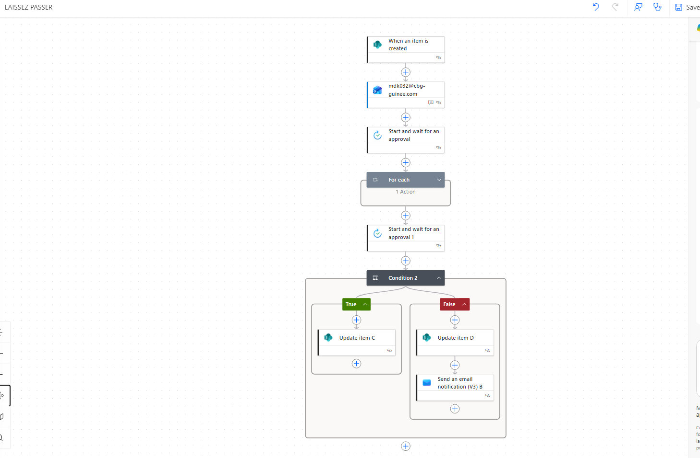
    </a>
    
<strong>Power Automate Flow</strong> Workflow d'approbation

  

  

    <a href="IMAGES/automation1.png" target="_blank" rel="noopener noreferrer">
      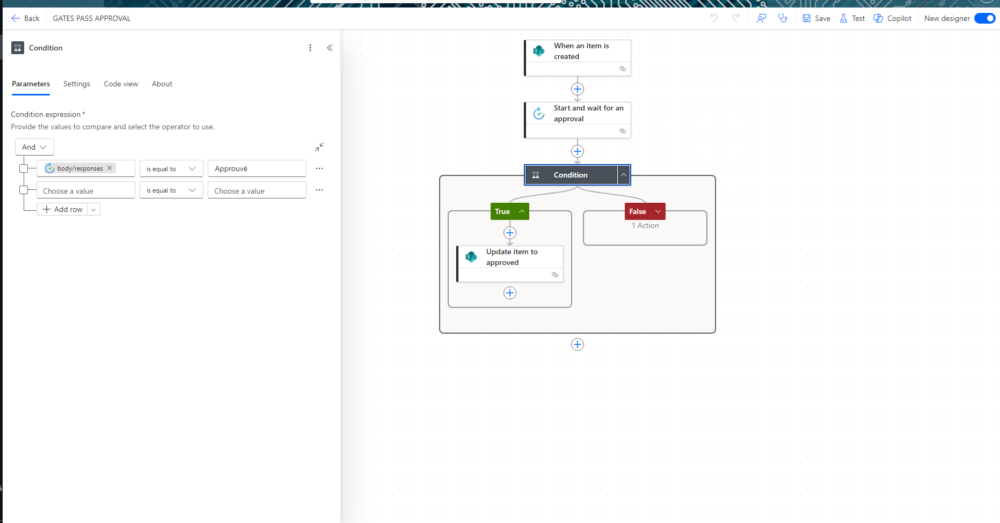
    </a>
    
<strong>Configuration du flux</strong> Paramètres Power Automate

  

  

    <a href="IMAGES/automationpdfflowError.png" target="_blank" rel="noopener noreferrer">
      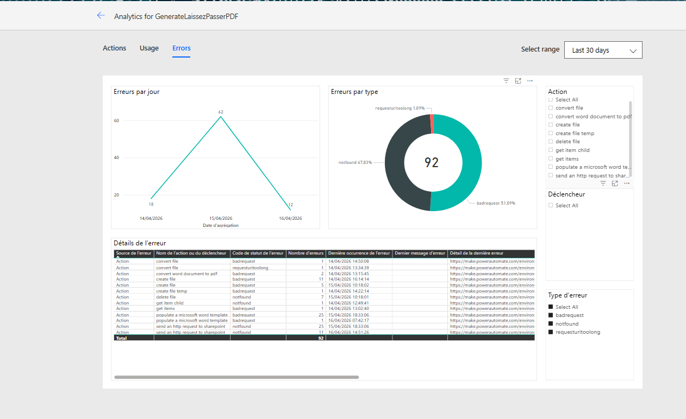
    </a>
    
<strong>Gestion des erreurs</strong> Débogage du flux PDF

  

  

    <a href="IMAGES/automationpdfflowusage.png" target="_blank" rel="noopener noreferrer">
      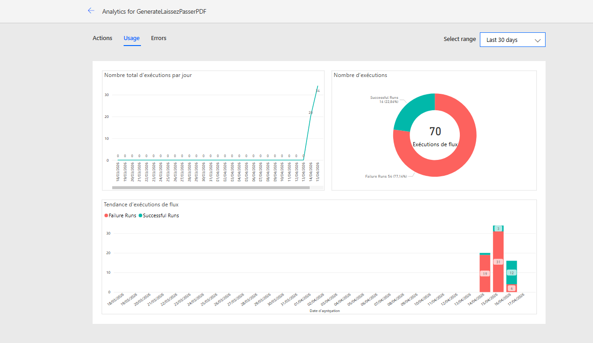
    </a>
    
<strong>Utilisation du flux</strong> Exécution du générateur PDF

  

  

    
    
<strong>CBG Social Housing Dashboard</strong> Foreseen Dashboard

  

  

    
    
<strong>Souscription</strong> Have a look Subscription clue

  

  

    
    
<strong>Embedding Clue</strong> Attribution

  

  

    
    
<strong>Dream Machine</strong> Dream Big

  

  

    
    
<strong>Overcome</strong> Weight Your fears down

  

  

    
    
<strong>Team</strong> Team Up to handle challenges

  

  

    
    
<strong>SAP </strong> Work with SAP one of the best

  

  

    
    
<strong>Toward evolution</strong> Top manager decisions upgrading tool

  

  

    
    
<strong>Managing means guiding</strong> Always refining

  

  

    
    
<strong>Managing with tools</strong> Tips about tools

  

  

    
    
<strong>M365 Env Apps</strong> My 365 Apps

  

  

    
    
<strong>Housing App Dev Ongoing</strong> Test Page of Housing Apps Dev

  

  

    <a href="IMAGES/powerbi3.png" target="_blank" rel="noopener noreferrer">
      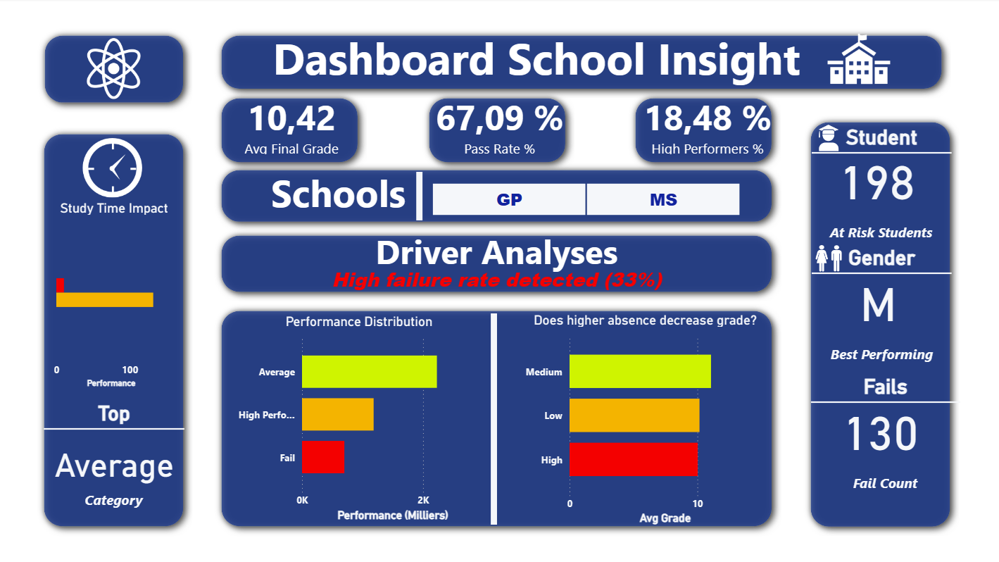
    </a>
    
<strong>WorldBank School Analysis</strong> School Dashboard Data from World Bank

  

  

    <a href="IMAGES/powerbi2.png" target="_blank" rel="noopener noreferrer">
      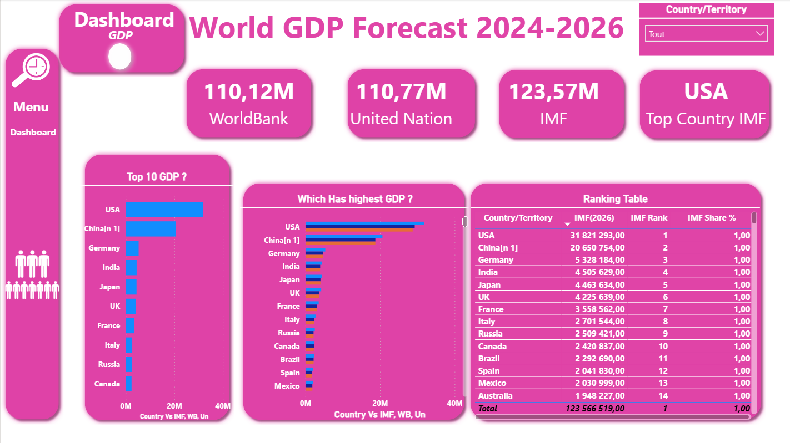
    </a>
    
<strong>UN Scarecity</strong> United Nations Data Analyses of Growth

  

  

    <a href="IMAGES/powerbi1.png" target="_blank" rel="noopener noreferrer">
      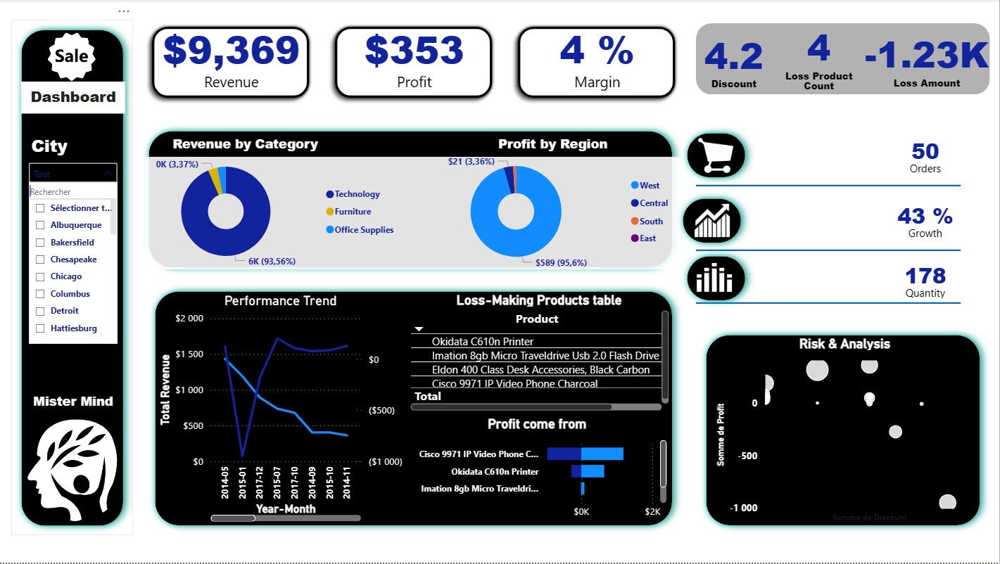
    </a>
    
<strong>USA sales Analyses</strong> United States Of America Sales

  

  

    
    
<strong>SAP Website</strong> Learning SAP

  

  

    <a href="IMAGES/navigate.png" target="_blank" rel="noopener noreferrer">
      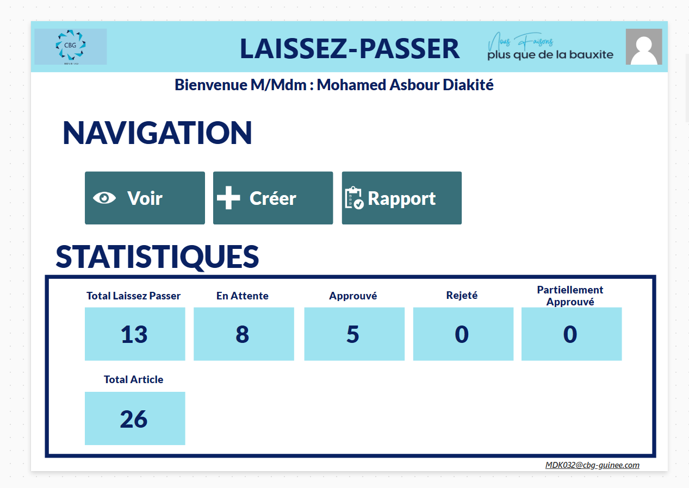
    </a>
    
<strong>GatePass Dashboard</strong> Our GatePass Apps Dashboard(PowerApps)

  

  

    
    
<strong>PUB400</strong> PUB400 Main Interface

  

  

    <a href="IMAGES/Printingautomationfrompowerapps.png" target="_blank" rel="noopener noreferrer">
      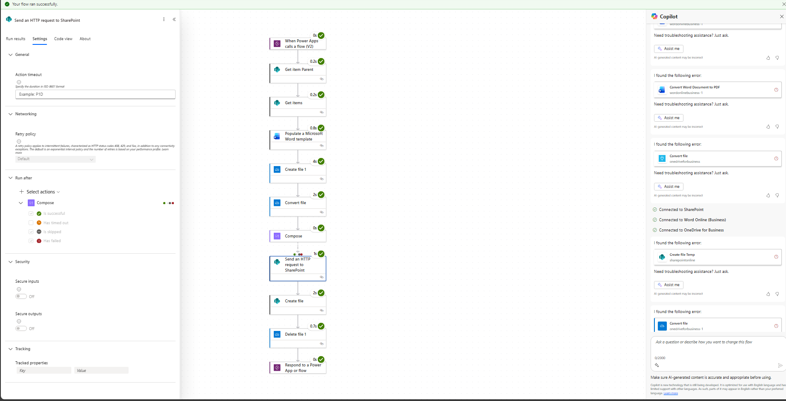
    </a>
    
<strong>Power Automate</strong> Automation for PDF Printing

  

  

    <a href="IMAGES/stepextractingdatachoosetableandselectfieldsneed.png" target="_blank" rel="noopener noreferrer">
      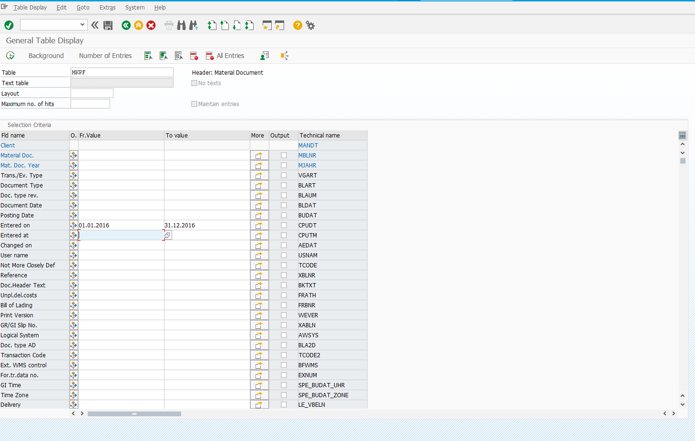
    </a>
    
<strong>How to Extract data from SAP</strong> SAP DATA Sensitive

  

  

    <a href="IMAGES/Datto.png" target="_blank" rel="noopener noreferrer">
      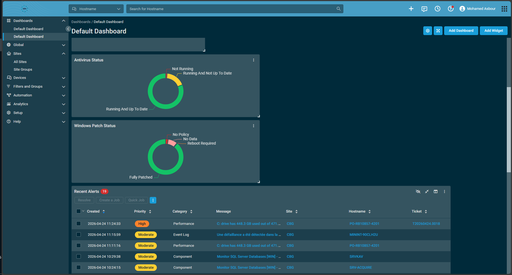
    </a>
    
<strong>Datto</strong> Helping User from Distance

  

  

    <a href="IMAGES/gatepass_main.png" target="_blank" rel="noopener noreferrer">
      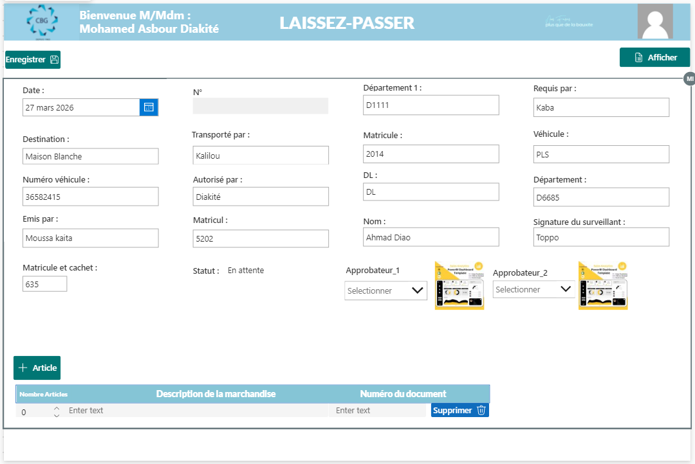
    </a>
    
<strong>Showing</strong> GatePass_Main

  

  

    <a href="IMAGES/gatepass_printablescreen.png" target="_blank" rel="noopener noreferrer">
      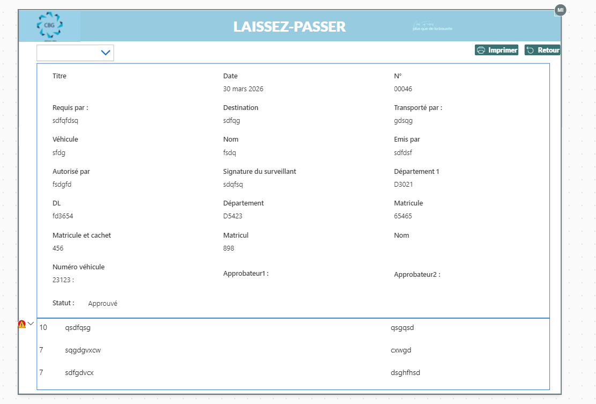
    </a>
    
<strong>Draft</strong> GatePass-Printing Screen Draft

  

  

    <a href="IMAGES/laisserpassez.png" target="_blank" rel="noopener noreferrer">
      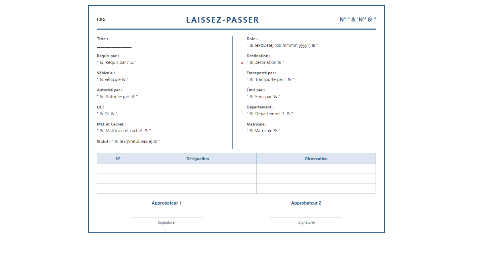
    </a>
    
<strong>will</strong> GatePass will

  

  

    
    
<strong>Just Fiori</strong> SAP Fiori launch Pad

  

  

    
    
<strong>Have a look </strong> Some transactions within SAP

  

  

    <a href="IMAGES/automations.png" target="_blank" rel="noopener noreferrer">
      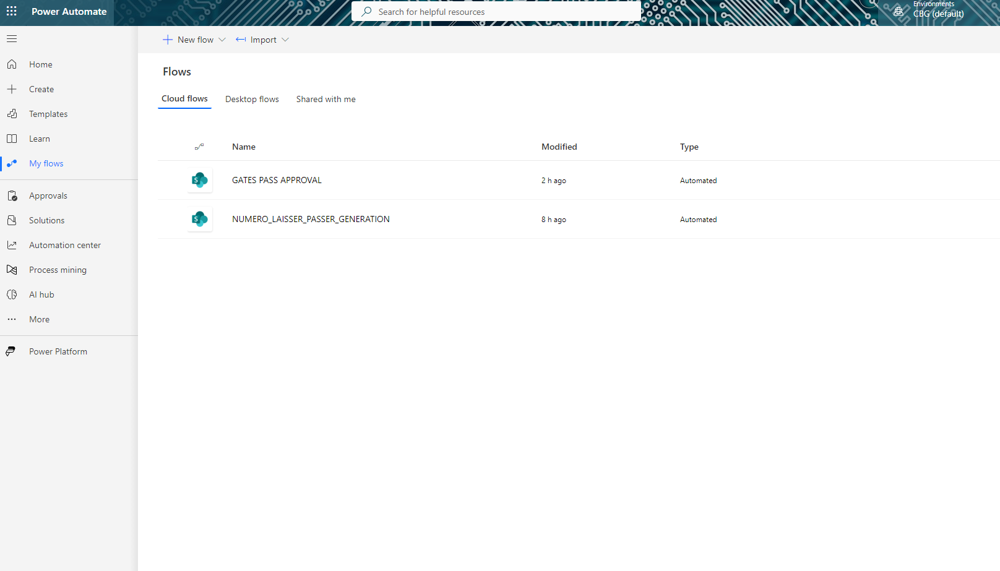
    </a>
    
<strong>Ms Automation</strong> Dashboard of Power Automate

  

  

    <a href="IMAGES/Autotask.png" target="_blank" rel="noopener noreferrer">
      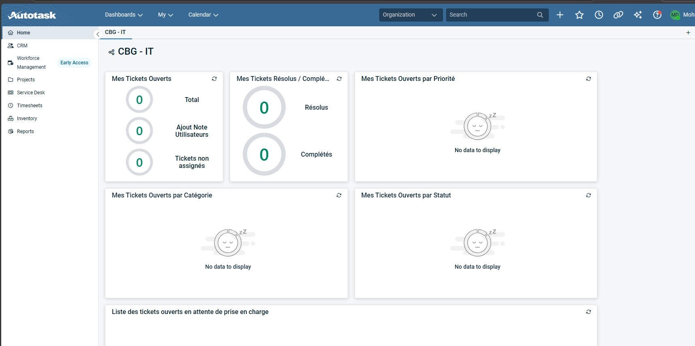
    </a>
    
<strong>Autotask as its name is</strong> Embedding Task to the personel

  

  

    
    
<strong>Just Fiori</strong> SAP Fiori launch Pad

  

  

    
    
<strong>Fiori User </strong> Fiori' right we need to know who you are

  

  

    
    
<strong>Just Fiori</strong> User Has types within it

  

  

    
    
<strong>Just Fiori</strong> Fiori what it really takes

  

  

    
    
<strong>SAP Config</strong> SAP Config continuity Choice of Env

  

  

    
    
<strong>SAP Config</strong> SAP config Continuity

  

  

    
    
<strong>Config Env</strong> SAP Env Config

  

  

    
    
<strong>SAP HANA</strong> SAP Certification Path

  

  

    
    
<strong>OBS Choose Type of screen Caption</strong> OBS Studio After Setting Up

  

  

    
    
<strong>OBS STUDIO</strong> OBS SETTINGS

  

  

    
    
<strong>OBS STUDIO</strong> OBS STUDIO config

  

  

    
    
<strong>OBS Studio</strong> OBS Studio config

  

  

    
    
<strong>First Hands On Power Apps</strong> My First PowerApps built EntryPoint

  

  

    <a href="IMAGES/TransactionsSAP/powerappsflowdashb.png" target="_blank" rel="noopener noreferrer">
      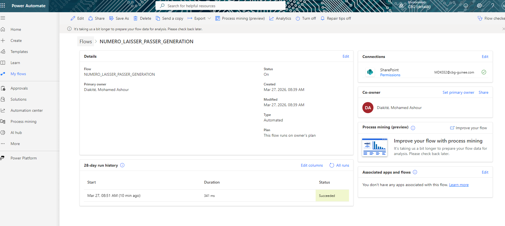
    </a>
    
<strong>Dashboard</strong> PowerAppsFlow Dashb

  

  

    
    
<strong>Programming P_apps</strong> How Programming looks like in Power Apps

  

  

    
    
<strong>SAP Flow</strong> Procurement flow within SAP

  

---

*Fin du rapport - **Asbour Kaba Mohamed Diakité** - 2026*

>*GOD AS CEO AS ALWAYS*  
>**GO BEYOND PLUS ULTRA.**

<!-- ==================== RIGHT TOC (ON THIS PAGE) ==================== -->

### 📑 Sur cette page

<strong>Navigation rapide</strong>

 

- [Confidentialité](#confidentialite)
- [Couverture](#couverture)
- [Remerciements](#remerciements)
- [Objectifs](#objectifs-strategiques-du-stage)

